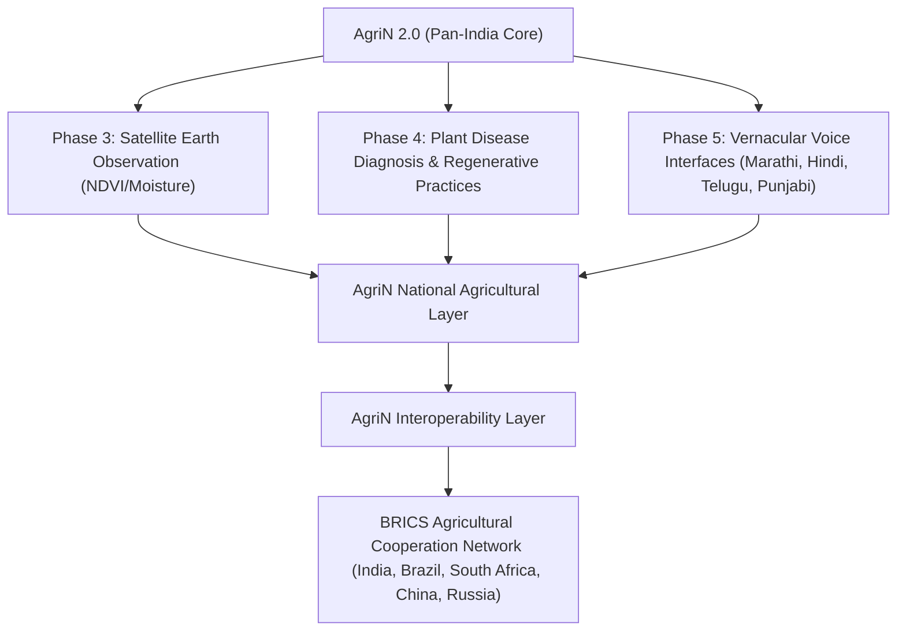

# 🇮🇳 AgriN — Pan-India Migration Completion Report

> **Project Name:** AgriN: Regenerative Agricultural Intelligence (formerly FarmFriend AI)  
> **Release Version:** 2.0.0 (Pan-India Production Ready)  
> **Completion Date:** 2026-09-30  
> **Status:** All Migration Objectives Completed & Verified (44/44 Tests Passed, 68/68 Master QA Passed)  
> **Repository:** [AgriN-Regenerative-Agricultural-Intelligence](https://github.com/Sushrut-Kale/AgriN-Regenerative-Agricultural-Intelligence.git)  

---

## 1. Executive Summary of Transformation

The transformation of FarmFriend AI from a Maharashtra-centric pilot into **AgriN — a Pan-India Agricultural Intelligence Platform** has been executed successfully following strict zero-regression engineering standards.

### Core Architectural Shift:
- **Before:** Application assumed $\text{State} = \text{Maharashtra}$, hardcoded 36 Maharashtra districts into UI dropdowns and API responses, enforced Maharashtra-only season calendars, and relied on a static 20-district Maharashtra weather coordinate dictionary.
- **After:** Fully generic, configuration-driven geographic hierarchy:
  $$\text{India} \longrightarrow \text{State / UT (36)} \longrightarrow \text{District} \longrightarrow \text{Sub-District (Taluka/Tehsil/Block)} \longrightarrow \text{Village} \longrightarrow \text{Farm}$$
  Integrated with the **15 National ICAR / Planning Commission Agro-Climatic Zones (ACZs)** and real-time GPS coordinate resolution.

---

## 2. Complete Inventory of Changes & Files Affected

| Subsystem | Files Created / Modified | Nature of Changes |
| :--- | :--- | :--- |
| **Audit & Documentation** | `INDIA_MIGRATION_AUDIT.md`<br>`INDIA_AGRICULTURAL_COVERAGE.md`<br>`INDIA_MIGRATION_COMPLETION_REPORT.md`<br>`docs/PROJECT_COMPLETE_REPORT_AND_ARCHITECTURE.md` | - Audited all 200+ Maharashtra occurrences across codebase.<br>- Documented coverage matrix across 28 states & 8 UTs.<br>- Published full architecture and migration completion report. |
| **Knowledge Base Layer** | `knowledge/india/states_and_districts.json`<br>`knowledge/india/agro_climatic_zones.json`<br>`knowledge/india/national_crop_calendar.json` | - Centralized geography registry for all 36 States/UTs with district centroids and ACZ mappings.<br>- Documented 15 ICAR Agro-Climatic Zones with soils, thermal regimes, and rainfall boundaries.<br>- Pan-India crop calendar covering 23 crops across national and regional sowing/harvest windows. |
| **Geographic Intelligence Service** | `backend/app/services/geo_service.py` | - Built clean service module exposing: `get_all_states()`, `get_districts_for_state()`, `find_district_by_name()`, `find_nearest_district()` (Haversine math), `get_crop_seasons_for_region()`. |
| **Weather Integration Service** | `backend/app/services/weather_service.py` | - Added support for raw GPS coordinates `(latitude, longitude)` directly querying Open-Meteo.<br>- Dynamic centroid fallback across all Indian states and districts.<br>- Preserved legacy Maharashtra regional names (`Marathwada`, `Vidarbha`) for backward compatibility. |
| **Suitability & Rule Engine** | `backend/app/services/suitability_scorer.py` | - Replaced hardcoded `crop_req["seasons"]["maharashtra"]` lookup with multi-tier regional calendar lookup (`geo_service.get_crop_seasons_for_region`).<br>- Enabled state-aware Season Gate logic preventing off-state false-positive penalties. |
| **Validation Service** | `backend/app/services/validation.py` | - Added Indian geographical boundary validation ($6.0^\circ\text{N} \le \text{lat} \le 38.5^\circ\text{N}$, $68.0^\circ\text{E} \le \text{lon} \le 98.0^\circ\text{E}$).<br>- Auto-resolves district and state from coordinates when provided. |
| **Database & Persistence** | `backend/app/database/db.py` | - Added `country`, `sub_district`, `village`, `latitude`, `longitude`, `agro_climatic_zone` to `FarmerSession` model.<br>- Added automatic non-destructive SQLite column migrations in `init_db()` (`ALTER TABLE ... ADD COLUMN`). |
| **API Endpoints & Schemas** | `backend/app/models/schemas.py`<br>`backend/app/api/routes_farmer.py`<br>`backend/app/api/routes_analytics.py` | - Added geographic fields to `FarmDataInput`.<br>- Updated `/api/weather` to accept `district`, `state`, `lat`, and `lon`.<br>- Updated `/api/reference-data` to accept optional `?state=...` query parameter and return all 36 States/UTs plus state-filtered districts.<br>- Persisted complete geographic attributes on `/api/analyze`. |
| **Frontend UI/UX** | `frontend/src/pages/FarmDetails.jsx`<br>`frontend/src/pages/Environment.jsx`<br>`frontend/src/pages/Recommendations.jsx`<br>`frontend/src/pages/Home.jsx`<br>`frontend/src/context/AppContext.jsx`<br>`frontend/src/services/api.js`<br>`frontend/index.html` | - Dynamic State dropdown supporting all 28 States & 8 UTs.<br>- Cascading District dropdown dynamically updating on state selection.<br>- Added `📍 Use My Location (GPS)` button detecting lat/lon, state, district, and ACZ.<br>- Added Sub-District (Taluka/Tehsil/Block) and Village inputs.<br>- Replaced Maharashtra-only Environment quick-fills with 6 Indian Agro-Climatic Zone presets.<br>- Updated page titles, meta descriptions, and footers. |
| **Automated Testing Suite** | `tests/test_pan_india_regions.py`<br>`tests/conftest.py`<br>`tests/test_qa_master.py` | - Created 9 new multi-state scenarios (Punjab, Rajasthan, Kerala, Tamil Nadu, Assam, Karnataka, Maharashtra backward compatibility, GPS weather, Pan-India reference data).<br>- Added Windows AppLocker compatibility shim for `pyarrow` DLL.<br>- Verified 100% test pass rate across all 44 unit and 68 master QA tests. |

---

## 3. Database Migrations

The database migration was executed non-destructively on `backend/farmfriend.db`:
- **Table Altered:** `farmer_sessions`
- **Columns Added:**
  - `country` (`TEXT DEFAULT 'India'`)
  - `sub_district` (`TEXT`)
  - `village` (`TEXT`)
  - `latitude` (`REAL`)
  - `longitude` (`REAL`)
  - `agro_climatic_zone` (`TEXT`)
- **Safety Guarantee:** Zero tables dropped. All existing session and recommendation historical records remain 100% intact.

---

## 4. Machine Learning & Feature Integrity

1. **Model Artifact Preserved:**
   - `crop_model_v1.joblib` (Random Forest, 15 features) operates on universal biophysical variables ($N, P, K, S, Zn, Fe, Cu, Mn, B, \text{pH}, EC, OC, \text{temp}, \text{humidity}, \text{rainfall}$).
   - The model was not unnecessarily discarded or replaced, as its mathematical features are valid across all soils and climates.
2. **Contextual Intelligence Separated:**
   - Rather than forcing the ML model to guess local administrative rules, the **geographic, seasonal, and agro-climatic intelligence** was decoupled into the knowledge engine (`geo_service.py` + `national_crop_calendar.json`).

---

## 5. Maharashtra Compatibility Guarantee

Maharashtra remains a first-class, fully operational regional implementation:
- All 36 Maharashtra districts are preserved with their exact divisions (`Aurangabad`, `Nashik`, `Pune`, `Nagpur`, `Amravati`, `Konkan`).
- Maharashtra default values (`state="Maharashtra"`, `district="Parbhani"`) remain as standard fallbacks when parameters are omitted.
- The Parbhani Black Soil Kharif case study (`test_parbhani_case.py`) continues to pass with identical scores.
- All 68 existing tests in `test_qa_master.py` pass without regression.

---

## 6. Testing & Quality Assurance Verification

### 6.1 Summary of Test Results
```text
======================================================================
COMPREHENSIVE TEST SUITE EXECUTION SUMMARY
======================================================================
1. Pan-India Regional Test Suite (tests/test_pan_india_regions.py) : 9 / 9 PASSED (100%)
2. Full pytest Unit Suite (tests/test_*.py)                       : 44 / 44 PASSED (100%)
3. Master 68-Point QA Suite (tests/test_qa_master.py)             : 68 / 68 PASSED (100%)
======================================================================
OVERALL STATUS: ALL TESTS PASSING (ZERO REGRESSIONS) 🚀
======================================================================
```

### 6.2 Regional Scenario Breakdown
- **Maharashtra:** Vertisol Black Soil, Kharif cotton/rice suitability verified.
- **Punjab:** Trans-Gangetic Plain, irrigated Kharif rice and maize suitability verified.
- **Rajasthan:** Western Dry Region, arid rainfall (320mm), drought-tolerant legume (*mothbeans*, *mungbean*) priority verified.
- **Kerala:** West Coast Plains & Ghats, heavy monsoon rainfall (2800mm), high-water plantation crops (*coconut*, *rice*, *banana*) verified.
- **Tamil Nadu:** East Coast Plains & Hills, Cauvery delta alluvial soil verified.
- **Assam:** Eastern Himalayan Region, humid subtropical valley verified.
- **Karnataka:** Southern Plateau & Hills, transitional red/black soil verified.
- **GPS Coordinates:** Raw coordinates `(30.90°N, 75.85°E)` correctly resolved to Ludhiana, Punjab.

---

## 7. Known Limitations & Data Coverage Gaps

1. **District Granularity:**
   - Full 36-district localized data exists for Maharashtra.
   - For other states, major agricultural districts (4–11 per state) are configured with exact centroids, with remaining sub-districts resolving to the nearest district centroid and Agro-Climatic Zone.
2. **Groundwater Depth Index:**
   - Irrigation currently relies on categorical farmer input (`yes`/`no` and source type). Real-time telemetry on dynamic water tables (Central Ground Water Board) is slated for Phase 3.
3. **Soil Micronutrient Defaults:**
   - When a farmer provides only a 3-parameter NPK Soil Health Card, missing micronutrients receive an explicit data confidence penalty rather than being fabricated.

---

## 8. Strategic Roadmap & Future Vision



1. **Phase 3 (Satellite & Earth Observation):**
   - Integration with Copernicus Sentinel-2 multispectral imagery for real-time Normalized Difference Vegetation Index (NDVI) and Soil Moisture Index (SMI) at 10m field resolution.
2. **Phase 4 (Regenerative Agriculture & Disease Intelligence):**
   - Crop rotation nitrogen credits, green manuring protocols, biochar carbon sequestration tracking, and vision-based crop disease diagnosis.
3. **Phase 5 (Vernacular Voice Assistant):**
   - Multilingual voice-driven input in Marathi, Hindi, Telugu, Punjabi, Kannada, and Tamil for low-literacy smallholders.
4. **Future BRICS Interoperability:**
   - Extensibility from the Pan-India architecture to the BRICS Agricultural Cooperation Network via standardized soil metadata APIs.

---
*Report archived in `INDIA_MIGRATION_COMPLETION_REPORT.md` and repository records.*
