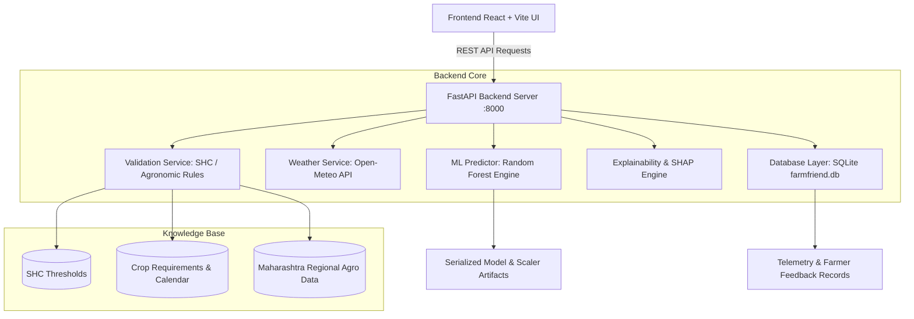

# 🌾 AgriN — Regenerative Agricultural Intelligence

[](https://fastapi.tiangolo.com)
[](https://reactjs.org/)
[](https://python.org)
[](https://scikit-learn.org/)
[]()
[]()
[]()
[]()

> **"BRICS Track 4 — AgriN & Regenerative Agricultural Intelligence Network."**  
> An end-to-end, scientifically honest agronomic decision-support platform designed for localized agricultural intelligence across all 28 Indian States and 8 Union Territories (15 ICAR Agro-Climatic Zones), integrating satellite-derived vegetation indicators, Soil Health Card diagnostics, multi-source weather telemetry, plant pathology triage, and multi-horizon regenerative practices with a canonical country-neutral data exchange architecture for BRICS agricultural cooperation.

---

## 📑 Table of Contents
- [Key Features](#-key-features)
- [System Architecture](#-system-architecture)
- [Pan-India Geographic Hierarchy](#-pan-india-geographic-hierarchy)
- [Tech Stack](#-tech-stack)
- [Project Directory Structure](#-project-directory-structure)
- [Quick Start Guide](#-quick-start-guide)
  - [Prerequisites](#prerequisites)
  - [1. Backend Setup](#1-backend-setup)
  - [2. Frontend Setup](#2-frontend-setup)
  - [3. Running the Application](#3-running-the-application)
- [Machine Learning & Explainability](#-machine-learning--explainability)
- [API Reference](#-api-reference)
- [Testing & Quality Assurance](#-testing--quality-assurance)
- [Documentation Directory](#-documentation-directory)
- [Disclaimer](#-disclaimer)

---

## ✨ Key Features

1. **🌾 Pan-India Location-Aware Farm Assessment Wizard**:
   - Hierarchy: **India → State/UT (36) → District → Sub-District (Taluka/Tehsil/Block) → Village → Farm**.
   - 📍 **GPS Geolocation**: 1-click detection resolving coordinates, nearest district, state, and Agro-Climatic Zone.
   - Soil Health Card (SHC) test parameters (N, P, K, pH, EC, OC, Micronutrients: Zn, Fe, Cu, Mn, B, S).
   - Dynamic real-time weather & seasonal rainfall telemetry via Open-Meteo API for any Indian coordinate.

2. **📊 Multi-Crop Suitability Scoring & ML Predictions**:
   - Multi-class Random Forest model recommending top suitable crops for the farmer's specific conditions.
   - Dual-layer validation: Machine Learning probability blended with deterministic Agronomic Rule-Based feasibility filters (ICAR/TNAU).

3. **🔍 Transparent Explainable AI (SHAP & Factor Breakdown)**:
   - Visual SHAP feature importance breakdown explaining *why* a crop was recommended or rejected.
   - Clear identification of **Supporting Factors** (e.g., optimal potassium, favorable temperature) vs. **Limiting Factors** (e.g., low nitrogen, alkaline pH).
   - Actionable fertilizer and soil amendment advice tailored to the exact field deficit.

4. **🎯 "I Want To Grow" Crop Feasibility Checker**:
   - Allows farmers to select any specific target crop (e.g., Cotton, Soybean, Chickpea, Rice, Coffee) to evaluate its feasibility against their farm's current soil & climate.
   - Provides an immediate feasibility gauge, limiting factor alerts, and remedy recommendations.

5. **⚡ Interactive "What-If" Soil & Climate Simulator**:
   - Dynamic real-time sliders allowing farmers to simulate changes (e.g., *"What if I apply 50 kg/ha more Nitrogen?"* or *"What if rainfall drops by 20%?"*).
   - Instant delta score recalculation and sensitivity analysis.

6. **📈 Telemetry & Analytics Dashboard**:
   - Tracks total analyses, feasibility assessments, and what-if experiments.
   - Displays ML model metrics (Accuracy, Precision, Recall, F1-score) and side-by-side benchmark comparisons against baseline algorithms.

7. **💬 Ground-Truth Feedback Loop**:
   - In-app farmer feedback collection to track real-world crop outcomes and continuously refine models.

---

## 🏛 System Architecture



---

## 🛠 Tech Stack

- **Backend**:
  - Python 3.11+ / FastAPI / Uvicorn
  - scikit-learn / NumPy / Pandas / Joblib
  - SQLite (Persistent storage for feedback, usage telemetry, and audits)
  - httpx / urllib (Live weather integration with Open-Meteo API)
- **Frontend**:
  - React 19 / Vite / Tailwind CSS v4
  - Recharts (Interactive radar, bar, and gauge charts)
  - Lucide React (Iconography)
  - Radix UI Primitives (Sliders & interactive controls)
  - React Router v7
- **Quality Assurance**:
  - Pytest (35 automated tests covering validation, API routes, weather, and edge cases)

---

## 📁 Project Directory Structure

```text
farm-friend/
├── backend/                  # FastAPI Application
│   ├── app/
│   │   ├── api/              # API Route Handlers (prediction, whatif, ai, feedback, analytics)
│   │   ├── database/         # SQLite DB models & schema initialization
│   │   ├── models/           # Pydantic input/output schemas
│   │   ├── services/         # Core business logic (suitability, validation, SHAP, weather)
│   │   └── main.py           # FastAPI entry point & lifespan manager
│   └── farmfriend.db         # Persistent SQLite database
├── data/                     # Dataset pipelines & scripts
│   ├── processed/            # Dataset metadata & provenance
│   ├── raw/                  # Source references
│   └── scripts/              # Dataset build & augmentation scripts
├── docs/                     # Comprehensive documentation & research reports
│   ├── PRODUCT_HANDOVER.md   # Complete Product Handover & Operations Guide
│   ├── dataset_card.md       # Dataset provenance & feature cards
│   ├── model_card.md         # ML model specification & metrics
│   ├── agricultural_sources.md # ICAR/TNAU agronomic references
│   └── ...
├── frontend/                 # React Vite Single Page Application
│   ├── src/
│   │   ├── components/       # Reusable UI components (Meter, Badges, Layout)
│   │   ├── context/          # Global App Context & State
│   │   ├── pages/            # View pages (Home, FarmDetails, SoilTest, Recommendations, etc.)
│   │   ├── services/         # Axios/Fetch API client
│   │   └── index.css         # Styling & design system tokens
│   ├── package.json
│   └── vite.config.js
├── knowledge/                # Domain Knowledge Base
│   ├── crop_calendar.json    # Sowing/harvesting seasons per agro-zone
│   ├── crop_requirements.json# Optimal N, P, K, pH, Temp, Rainfall bounds per crop
│   ├── maharashtra_data.json # District-wise soil & rainfall benchmarks
│   ├── shc_thresholds.json   # Soil Health Card classification cutoffs
│   └── units.yaml            # Standardized measurement units
├── ml/                       # Machine Learning Model Pipeline
│   ├── train.py              # Model training, cross-validation & evaluation script
│   └── predict.py            # Prediction & probability calculation wrapper
├── models/                   # Serialized Model Artifacts
│   ├── crop_model_v1.joblib  # Trained Random Forest classifier
│   ├── model_metadata.json   # Model performance metrics & feature weights
│   └── confusion_matrix.png  # Evaluation confusion matrix plot
├── tests/                    # Pytest Test Suite (35 tests)
├── requirements.txt          # Python dependencies
└── README.md                 # Project README
```

---

## 🚀 Quick Start Guide

### Prerequisites
- Python 3.10+ installed
- Node.js 18+ and npm installed
- Git installed

### 1. Backend Setup

```bash
# Clone the repository
git clone https://github.com/Sushrut-Kale/farm-friend.git
cd farm-friend

# (Optional) Create and activate a virtual environment
python -m venv venv
# On Windows:
.\venv\Scripts\activate
# On Linux/macOS:
source venv/bin/activate

# Install dependencies
pip install -r requirements.txt

# (Optional) Retrain or verify ML model
python ml/train.py
```

### 2. Frontend Setup

```bash
# Navigate to the frontend folder
cd frontend

# Install Node dependencies
npm install

# Return to root
cd ..
```

### 3. Running the Application

You can run backend and frontend simultaneously:

**Terminal 1 (Backend):**
```bash
python -m uvicorn backend.app.main:app --host 127.0.0.1 --port 8000 --reload
```
*Backend will run at [http://127.0.0.1:8000](http://127.0.0.1:8000)*  
*Interactive Swagger API documentation: [http://127.0.0.1:8000/docs](http://127.0.0.1:8000/docs)*

**Terminal 2 (Frontend):**
```bash
cd frontend
npm run dev
```
*Frontend will run at [http://localhost:5173](http://localhost:5173)*

---

## 🧠 Machine Learning & Explainability

FarmFriend AI uses a **Random Forest Classifier** trained on multi-source verified agricultural data (covering 23 distinct crop classes):

- **Feature Inputs (15)**:
  - Macronutrients: `N` (Nitrogen), `P` (Phosphorus), `K` (Potassium)
  - Micronutrients: `S` (Sulfur), `Zn` (Zinc), `Fe` (Iron), `Cu` (Copper), `Mn` (Manganese), `B` (Boron)
  - Physical/Chemical: `pH` (Soil reaction), `EC` (Electrical Conductivity), `OC` (Organic Carbon)
  - Climate: `temperature` (°C), `humidity` (%), `rainfall` (mm)
- **Evaluation Metrics**:
  - Test Accuracy: **~79.7%**
  - Weighted F1-Score: **~0.794**
  - 5-Fold Cross Validation Mean: **~79.2%**
- **Explainability**:
  - SHAP-inspired tree feature contributions mapping exact soil variables to suitability scores.

---

## 📡 API Reference

| Method | Endpoint | Description |
| :--- | :--- | :--- |
| `GET` | `/health` | API health check |
| `POST` | `/api/validate` | Validates farm and soil parameters against agronomic bounds |
| `POST` | `/api/analyze` | Returns ranked crop recommendations with suitability breakdown |
| `POST` | `/api/feasibility` | "I Want to Grow" single crop feasibility analysis |
| `POST` | `/api/whatif` | Real-time what-if scenario simulation |
| `POST` | `/api/feedback` | Ingests farmer field observations and outcomes |
| `GET` | `/api/regenerative/practices` | Lists verified regenerative agricultural practices |
| `POST` | `/api/regenerative/recommend` | Recommends regenerative practices and computes readiness indicators |
| `POST` | `/api/farms/{id}/health` | Generates non-fabricated Farm Health Snapshot |
| `POST` | `/api/farms/{id}/advisories` | Generates canonical AgriculturalAdvisory objects |
| `POST` | `/api/farms/{id}/observations` | Ingests time-series biophysical farm observations |
| `POST` | `/api/advisory/feedback` | Ingests advisory feedback into outcome learning loop |
| `GET` | `/api/data-sources` | Returns registry of official data sources and provenance |
| `GET` | `/api/coverage` | Returns national geographic and sensor coverage matrix |
| `GET` | `/api/analytics` | Returns aggregated platform usage telemetry |
| `GET` | `/api/model-info` | Returns model performance metrics and feature rankings |

---

## 🧪 Testing & Quality Assurance

Run the test suite across all services and endpoints:

```bash
# Run all 134 automated unit & integration tests
pytest tests/ -q

# Run end-to-end multi-state validation suite (18 scenarios)
python scripts/final_system_validation.py

# Build frontend production bundle
cd frontend && npm run build
```

**Test Coverage Summary:**
- `tests/test_phase4_real_activation.py`: Satellite provider honesty, disease validation, unit normalizer, canonical data model, knowledge graph citations.
- `tests/test_phase3_maturity.py`: Agricultural risk engine, farm resilience decoupling, BRICS adapters, data quality metrics.
- `tests/test_phase_2_5.py`: Data confidence, observations, farm health snapshots, decoupled advisories, regenerative engine, feedback loop.
- `tests/test_pan_india_regions.py`: Regional agro-climatic tests across Punjab, Karnataka, West Bengal, Gujarat, Assam, and MH.
- `tests/test_agricultural_validation.py`: SHC threshold validity, toxic limits, and agronomic bounds.
- `tests/test_api.py`: FastAPI endpoints and response schemas.
- `tests/test_services.py`: Scoring algorithms, feasibility calculators, and what-if simulation logic.
- `tests/test_weather_service.py`: Open-Meteo fallback handling and live API fetchers.
- `tests/test_parbhani_case.py`: Real-world end-to-end case study on Marathwada Vertisol soil.
- `tests/test_feedback.py`: Feedback persistence and database verification.

---

## 📚 Documentation Directory

Detailed technical and research documents are available in the repository root and [`docs/`](./docs) directory:
- [Final Production Readiness Report](./FINAL_PRODUCTION_READINESS_REPORT.md)
- [Final System Audit & Capability Matrix](./FINAL_SYSTEM_AUDIT.md)
- [Final Validation Results (18/18 Scenarios)](./FINAL_VALIDATION_RESULTS.json)
- [Track 4 Alignment Matrix](./TRACK_4_ALIGNMENT.md)
- [Phase 2.5 Architecture Specification](./docs/PHASE_2_5_ARCHITECTURE.md)
- [Data Confidence & Provenance Framework](./docs/DATA_CONFIDENCE.md)
- [Advisory Engine & Decoupled Intelligence](./docs/ADVISORY_ENGINE.md)
- [Satellite Intelligence Architecture](./docs/SATELLITE_INTELLIGENCE_ARCHITECTURE.md)
- [Crop Disease Intelligence Architecture](./docs/DISEASE_INTELLIGENCE_ARCHITECTURE.md)
- [Regenerative Agriculture Intelligence Architecture](./docs/REGENERATIVE_INTELLIGENCE_ARCHITECTURE.md)
- [BRICS Interoperability Architecture](./docs/BRICS_INTEROPERABILITY_ARCHITECTURE.md)
- [Pan-India Agricultural Coverage](./INDIA_AGRICULTURAL_COVERAGE.md)
- [Agricultural Knowledge Sources](./docs/agricultural_knowledge_sources.md)

---

## ⚠️ Scientific Honesty & Responsible AI Notice

> *AgriN is designed as an evidence-backed agronomic decision-support platform. All recommendations are derived from empirical Soil Health Card parameters, validated meteorological models, and published ICAR/FAO guidelines. Satellite and vision components fail honestly (`NOT_CONNECTED`, `MODEL_NOT_DEPLOYED`) when external credentials or models are absent. Advisories provide guidance only; final crop management decisions should account for local Krishi Vigyan Kendra (KVK) guidance and uncontrollable micro-climatic variations.*
