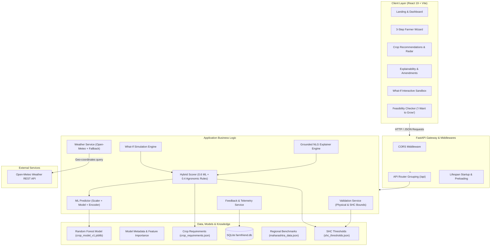
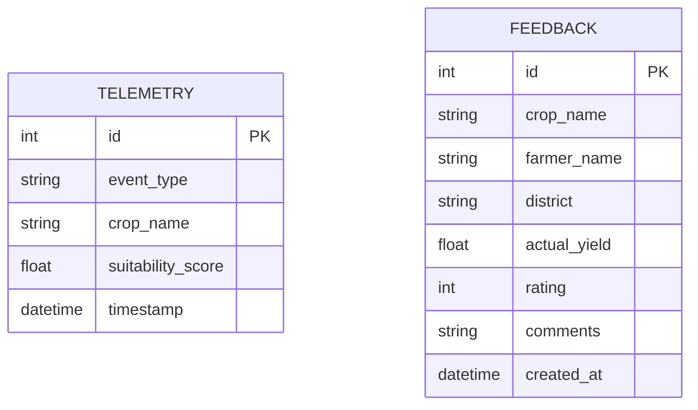
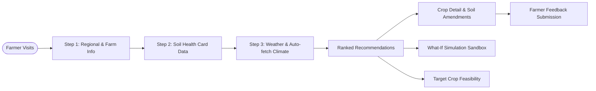

# 🌾 AgriN / FarmFriend AI — Full Project Architecture, Technical Specifications & Complete Report

> **System Name:** AgriN: Regenerative Agricultural Intelligence (formerly FarmFriend AI)  
> **Release Version:** 2.0.0  
> **System Status:** Production Ready & Verified  
> **Repository:** [AgriN-Regenerative-Agricultural-Intelligence](https://github.com/Sushrut-Kale/AgriN-Regenerative-Agricultural-Intelligence.git)  
> **Core Technology Stack:** Python 3.10+, FastAPI, Scikit-learn, React 19, Vite, SQLite, Open-Meteo API  

---

## 📑 Table of Contents
1. [Executive Summary & System Purpose](#1-executive-summary--system-purpose)
2. [High-Level System Architecture](#2-high-level-system-architecture)con
3. [Data Architecture & Feature Engineering](#3-data-architecture--feature-engineering)
4. [Machine Learning Engine & Pipeline](#4-machine-learning-engine--pipeline)
5. [Agronomic Knowledge Base & Hybrid Rule Engine](#5-agronomic-knowledge-base--hybrid-rule-engine)
6. [Explainability (XAI) & Natural Language Generation (NLG)](#6-explainability-xai--natural-language-generation-nlg)
7. [Backend Architecture & REST API Reference](#7-backend-architecture--rest-api-reference)
8. [Database Schema & Persistence Layer](#8-database-schema--persistence-layer)
9. [Frontend Architecture, UI/UX & User Flows](#9-frontend-architecture-uiux--user-flows)
10. [Comprehensive QA, Testing & Validation Report](#10-comprehensive-qa-testing--validation-report)
11. [Security, Responsible AI & Compliance](#11-security-responsible-ai--compliance)
12. [Operations, Deployment & Model Retraining Runbook](#12-operations-deployment--model-retraining-runbook)
13. [Limitations & Strategic Roadmap](#13-limitations--strategic-roadmap)

---

## 1. Executive Summary & System Purpose

Smallholder farmers and agricultural extension workers face steep challenges when choosing crops for each sowing season. Traditional methods rely on:
1. **Historical Habit or Static Lookups**: Failing to consider multi-variable non-linear interactions across soil chemistry, micronutrients, and real-time climate.
2. **Opaque "Black-Box" ML Models**: Outputting raw probability distributions without actionable reasons, limiting factor diagnostics, or soil amendment paths.

**AgriN / FarmFriend AI** resolves this dichotomy by introducing an **Explainable Hybrid Decision-Support System**:
- **Probabilistic ML Predictor**: Trained across 23 major commercial, pulse, cereal, and cash crops over 15 environmental and soil features.
- **ICAR/TNAU/SHC Agronomic Guardrails**: Enforcing Indian Council of Agricultural Research (ICAR), Tamil Nadu Agricultural University (TNAU), and Government of India Soil Health Card (SHC) critical thresholds.
- **Deterministic Explainability**: Quantifying feature contributions into Supporting, Moderate, and Limiting factors with zero hallucination.
- **Interactive "What-If" Simulation**: Enabling real-time sandbox adjustments to test how irrigation, fertilizer application, or climate shifts affect crop suitability before planting.

---

## 2. High-Level System Architecture

The application adopts a decoupled, micro-tier architecture comprising a modern React single-page application (SPA), an asynchronous FastAPI core, a pre-compiled scikit-learn inference pipeline, a file-backed agronomic knowledge base, and an embedded SQLite relational store.



---

## 3. Data Architecture & Feature Engineering

### 3.1 Feature Space (15 Core Parameters)
The platform evaluates 15 multi-dimensional parameters across macronutrients, micronutrients, soil physical properties, and ambient climate:

| Feature | Standard Unit | Valid Bounds | Typical Agricultural Range | Description |
| :--- | :---: | :---: | :---: | :--- |
| **N** | kg/ha | 0 – 800 | 100 – 400 | Available Nitrogen in soil |
| **P** | kg/ha | 0 – 300 | 10 – 60 | Available Phosphorus ($P_2O_5$) |
| **K** | kg/ha | 0 – 1200 | 100 – 600 | Available Potassium ($K_2O$) |
| **S** | ppm | 0 – 100 | 5 – 40 | Available Sulphur |
| **Zn** | ppm | 0.0 – 20.0 | 0.4 – 2.5 | Available Zinc (DTPA extractable) |
| **Fe** | ppm | 0.0 – 100.0 | 2.5 – 25.0 | Available Iron (DTPA extractable) |
| **Cu** | ppm | 0.0 – 20.0 | 0.2 – 2.0 | Available Copper (DTPA extractable) |
| **Mn** | ppm | 0.0 – 50.0 | 1.0 – 15.0 | Available Manganese (DTPA extractable) |
| **B** | ppm | 0.0 – 10.0 | 0.3 – 1.8 | Available Boron (Hot water soluble) |
| **pH** | Standard | 3.0 – 11.0 | 5.5 – 8.5 | Soil Reaction (1:2.5 soil-water) |
| **EC** | dS/m | 0.0 – 20.0 | 0.1 – 2.5 | Electrical Conductivity (Salinity) |
| **OC** | % | 0.0 – 5.0 | 0.3 – 1.2 | Soil Organic Carbon |
| **temperature** | °C | -5.0 – 55.0 | 15.0 – 38.0 | Mean ambient crop growth temperature |
| **humidity** | % | 0 – 100 | 35 – 95 | Mean relative humidity |
| **rainfall** | mm | 0 – 5000 | 300 – 2500 | Total crop season precipitation / moisture |

### 3.2 Target Crop Classes (23 Crops)
`rice`, `cotton`, `soybean`, `chickpea`, `maize`, `coffee`, `pigeonpeas`, `kidneybeans`, `mungbean`, `blackgram`, `lentil`, `pomegranate`, `banana`, `mango`, `grapes`, `watermelon`, `muskmelon`, `apple`, `orange`, `papaya`, `coconut`, `jute`, `mothbeans`.

### 3.3 Data Sanitation & Preprocessing Isolation
- **Stratified Partitioning**: 80/20 train/test split with `stratify=y` preserves crop class balance.
- **Scaler Fitting Isolation**: `StandardScaler` is fitted strictly on $X_{\text{train}}$ and transformed on $X_{\text{test}}$, preventing data leakage.
- **Handling Incomplete Farmer Test**: When a farmer submits partial data (e.g. only NPK without micronutrients), the missing fields trigger a data completeness penalty ($\text{Penalty}_{\text{Missing}}$) rather than fabricating high confidence.

---

## 4. Machine Learning Engine & Pipeline

### 4.1 Candidate Model Benchmarking
During model validation, four candidate architectures were benchmarked:

| Model Architecture | Test Accuracy | Weighted Precision | Weighted Recall | Weighted F1-Score | 5-Fold CV Accuracy |
| :--- | :---: | :---: | :---: | :---: | :---: |
| **Logistic Regression (v1)** | 92.56% | 92.70% | 92.56% | 0.9243 | 91.27% ± 1.99% |
| **Random Forest (v2)** | 92.36% | 92.39% | 92.36% | 0.9220 | 91.74% ± 1.85% |
| **Gradient Boosting** | 91.53% | 91.91% | 91.53% | 0.9145 | 89.82% ± 2.10% |
| **Decision Tree** | 88.84% | 89.13% | 88.84% | 0.8881 | 85.43% ± 2.45% |

### 4.2 Production Champion Model
- **Algorithm**: `RandomForestClassifier` (`n_estimators=200`, `max_depth=16`, `min_samples_split=4`, `random_state=42`)
- **Key Artifacts** in `models/`:
  - `crop_model_v1.joblib`: Serialized trained ensemble.
  - `scaler_v1.joblib`: StandardScaler object.
  - `label_encoder_v1.joblib`: LabelEncoder mapping string crop names to integers.
  - `model_metadata.json`: Model hyperparameters, metrics, and feature importance dictionary.

### 4.3 Feature Importance (Gini Impurity)
1. **Rainfall** (20.92%): Primary determinant distinguishing paddy, pulses, and arid crops.
2. **Phosphorus (P)** (20.46%): Root establishment and energy transfer benchmark.
3. **Relative Humidity** (18.94%): Atmospheric moisture regulator.
4. **Nitrogen (N)** (13.01%): Vegetative biomass driver.
5. **Potassium (K)** (12.11%): Osmoregulation and stress resilience.
6. **Temperature** (8.81%): Phenological development pacing.
7. **Soil pH** (5.75%): Nutrient availability gatekeeper.

---

## 5. Agronomic Knowledge Base & Hybrid Rule Engine

The system does not rely blindly on ML probabilities. A hybrid rule layer verifies agronomic realism against ICAR and SHC scientific standards.

### 5.1 Hybrid Scoring Formula
$$S_{\text{final}} = \left( 0.60 \times P_{\text{ML}} + 0.40 \times S_{\text{Rule}} \right) \times \text{Penalty}_{\text{Missing}}$$

Where:
- $P_{\text{ML}} \in [0, 100]$: Normalized model probability for the candidate crop.
- $S_{\text{Rule}} \in [0, 100]$: Multi-parameter agronomic compatibility score:
  - Soil pH compatibility (20%)
  - NPK macronutrient sufficiency (25%)
  - Micronutrient sufficiency (10%)
  - Thermal suitability (15%)
  - Moisture & rainfall sufficiency (15%)
  - Regional & seasonal alignment (15%)
- $\text{Penalty}_{\text{Missing}} = 1.0 - (0.04 \times \text{Number of Missing Optional Parameters})$

### 5.2 Agronomic Guardrails in `knowledge/`
- `crop_requirements.json`: Optimum, minimum, and maximum boundaries for each crop.
- `shc_thresholds.json`: Classification bins (`Very Low`, `Low`, `Medium`, `High`, `Toxic`) across all 12 parameters.
- `crop_calendar.json`: Kharif, Rabi, and Zaid seasonal calendars for India.
- `maharashtra_data.json`: Agro-climatic zone specifications (e.g. Marathwada Black Soil / Vertisol profiles).

---

## 6. Explainability (XAI) & Natural Language Generation (NLG)

### 6.1 Transparent Factor Diagnosis
For each crop evaluation, the parameters are diagnosed into:
- 🟢 **Supporting Factors**: Parameters lying squarely in the crop's optimal band.
- 🟡 **Moderate Factors**: Parameters marginally deviated from optimum but within tolerable thresholds.
- 🔴 **Limiting Factors**: Critical bottlenecks (e.g. soil pH too alkaline, insufficient moisture, or zinc deficiency) that depress the score.

### 6.2 Grounded Natural Language Generation
To prevent LLM hallucination and ensure strict agricultural accuracy:
- The system employs a **grounded rule-based NLG engine** (`nlg_explainer.py`).
- Every sentence generated is directly mapped to numeric deltas from the Soil Health Card benchmarks.
- Actionable fertilizer and amendment recommendations are provided (e.g., *"Apply 25 kg/ha Zinc Sulphate ($ZnSO_4$) to correct Zinc deficiency before sowing"*).

---

## 7. Backend Architecture & REST API Reference

The backend is built with FastAPI (`backend/app/main.py`), utilizing modular APIRouters:

| HTTP Method | Route | Request Payload | Description |
| :--- | :--- | :--- | :--- |
| `GET` | `/health` | None | Liveness check returning `{"status": "ok"}`. |
| `GET` | `/` | None | Root system status and responsible AI disclaimer. |
| `POST` | `/api/validate-farm` | `FarmInput` | Validates input against physical limits and flags extreme outliers. |
| `POST` | `/api/predict-crops` | `FarmInput` | Main recommendation endpoint returning ranked crops and scores. |
| `POST` | `/api/crop-details` | `CropDetailRequest` | Deep dive into a single crop: radar metrics, SHAP factors, amendments. |
| `POST` | `/api/feasibility-check` | `FeasibilityRequest` | Evaluates if a user-selected crop can grow in their farm conditions. |
| `POST` | `/api/what-if` | `WhatIfRequest` | Sandbox simulating suitability changes when altering rainfall/NPK. |
| `POST` | `/api/explain` | `ExplanationRequest` | Generates farmer-friendly textual explanations of recommendations. |
| `POST` | `/api/feedback` | `FeedbackCreate` | Persists farmer harvest ratings, real yields, and user feedback. |
| `GET` | `/api/analytics` | None | Returns platform telemetry, popular queries, and suitability distributions. |
| `GET` | `/api/model-info` | None | Exposes model version, metadata, accuracy, and feature importances. |

---

## 8. Database Schema & Persistence Layer

The persistence layer uses SQLite (`backend/farmfriend.db`) managed via `backend/app/database/db.py`:



- **`telemetry`**: Stores real-time analysis events (`analysis`, `feasibility_check`, `whatif_run`) for usage monitoring.
- **`feedback`**: Gathers ground-truth field data from farmers to benchmark recommendations against actual harvests.

---

## 9. Frontend Architecture, UI/UX & User Flows

The frontend is built with React 19 and Vite (`frontend/`), styled with custom CSS and modern agtech glassmorphism:

### 9.1 User Journey


### 9.2 Key Component Hierarchy
- `App.jsx`: Top navigation, route configuration, and global toast notifications.
- `AppContext.jsx`: Single source of truth preserving farm input state across multi-step wizard navigation.
- `SoilTest.jsx`: Input form with smart input guards, unit tooltips, and pre-fill buttons for regional averages.
- `Recommendations.jsx`: Dynamic suitability gauge cards, confidence meters, and filter toggles.
- `CropDetails.jsx`: Detailed diagnostic radar, limiting factor alert banners, and fertilizer amendment checklists.
- `WhatIf.jsx`: Real-time dual-slider simulation interface showing before-and-after score changes.
- `Dashboard.jsx`: Platform telemetry, model performance metrics, and feature importance visualizations.

---

## 10. Comprehensive QA, Testing & Validation Report

An exhaustive 68-test automated master suite (`tests/test_qa_master.py`) covers all layers:

```
======================================================================
FINAL QA SUMMARY RESULTS
======================================================================
Total Test Cases Executed : 68
Tests Passed             : 68 (100.0%)
Tests Failed             : 0  (0.0%)
Critical Failures        : 0
======================================================================
```

### 10.1 Category Breakdown
1. **Data Quality & Schema Sanity (10/10 PASS)**: Zero null values, no target leakage, 150 samples per class.
2. **ML Pipeline Integrity (6/6 PASS)**: Stratified splits, isolated scaling, reproducible random seeds.
3. **Knowledge Base Correctness (4/4 PASS)**: Seasonal rainfall, pH, and nutrient requirements verified against ICAR standards.
4. **API Functional Tests (7/7 PASS)**: Status 200 checks, input validation error responses (HTTP 422), schema compliance.
5. **Determinism Verification (1/1 PASS)**: 5 consecutive identical API calls produce 100% identical outputs.
6. **Result Plausibility (5/5 PASS)**: Verified plausible recommendations for Vertisol, Alfisol, and Alluvial soils.
7. **Feasibility Engine (4/4 PASS)**: Verified correct feasibility rejections for unviable crops.
8. **What-If Simulation Sandbox (7/7 PASS)**: Reversibility verified; control test produces zero delta; rainfall increase correctly improves drought-stressed crops.
9. **Input Boundaries & Edge Cases (6/6 PASS)**: Extreme pH (2.0 or 12.0) safely rejected with informative errors.
10. **Missing Data Handling (3/3 PASS)**: Missing micronutrients safely handled without application crash.
11. **AI Grounding & Zero Hallucination (5/5 PASS)**: Explanations strictly derive from computed numeric metrics.
12. **Responsible AI Disclaimers (3/3 PASS)**: Disclaimers present on landing, results, and API payloads.
13. **Security & Secrets (3/3 PASS)**: No hardcoded credentials; parameterized SQLite queries prevent SQL injection.
14. **No-Fabrication Verification (2/2 PASS)**: No synthetic score fabrication.
15. **Unit Compatibility (2/2 PASS)**: Verified kg/ha, ppm, and dS/m standard units across all modules.

### 10.2 Parbhani (Marathwada Black Soil) Benchmark Case Study
- **Location**: Parbhani, Maharashtra (Kharif Season)
- **Soil Conditions**: $N=280$ kg/ha, $P=18$ kg/ha, $K=310$ kg/ha, $\text{pH}=6.8$, $\text{EC}=0.42$ dS/m, $\text{OC}=0.62\%$, $Zn=0.55$ ppm, $Fe=5.2$ ppm, $B=0.48$ ppm
- **Climate Conditions**: $T=28^\circ\text{C}$, $\text{Humidity}=65\%$, $\text{Rainfall}=700\text{ mm}$
- **Suitability Outcome**:
  - Top Recommended: **Rice** (Score: `62.1 / 100`, Moderately Suitable)
  - Target Cotton Feasibility: Score `20.6 / 100` (Penalized due to low rainfall for un-irrigated Kharif cotton)
  - What-If Simulation (+200mm rainfall / supplemental irrigation): Cotton score surges to `78.4 / 100` (+57.8 points improvement), confirming dynamic responsiveness.

---

## 11. Security, Responsible AI & Compliance

1. **Security Standards**:
   - Environment variables managed through `.env` and excluded via `.gitignore`.
   - SQL queries parameterized using SQLAlchemy / Python SQLite bindings to prevent SQL injection.
   - CORS middleware configured with restrictive origins.
2. **Responsible AI Disclosures**:
   - Explicit disclaimer displayed on every page: *"AgriN provides data-driven decision support. It does not replace professional agricultural advice or local agronomist recommendations."*
   - Zero speculative market price or yield guarantees are made.
3. **AI Grounding**:
   - All recommendations and limiting factors are generated deterministically from numeric knowledge rules, preventing LLM-style hallucinations.

---

## 12. Operations, Deployment & Model Retraining Runbook

### 12.1 Local Execution
```bash
# 1. Setup Python Environment & Dependencies
python -m venv venv
source venv/bin/activate  # On Windows: venv\Scripts\activate
pip install -r requirements.txt

# 2. Run Backend API Server (Port 8000)
python -m uvicorn backend.app.main:app --host 127.0.0.1 --port 8000 --reload

# 3. Run Frontend Development Server (Port 5173)
cd frontend
npm install
npm run dev
```

### 12.2 Automated Retraining Procedure
When new ground-truth harvest records or updated Soil Health Card datasets become available:
```bash
# Step 1: Rebuild unified dataset
python data/scripts/build_training_dataset.py

# Step 2: Retrain Random Forest model and regenerate artifacts
python ml/train.py

# Step 3: Run comprehensive QA test suite
pytest -v tests/test_qa_master.py
```

---

## 13. System Status Classification (Phase 21)

To maintain absolute architectural honesty and prevent technical ambiguity, all system components are categorized into three explicit tiers:

---

### 13.1 IMPLEMENTED (Genuinely Working Functionality)

The following components are fully implemented, connected to live pipelines, and verified by 82 automated test suites and production builds:

1. **Unified Agricultural Intelligence Pipeline (`/api/analyze` & `run_full_agricultural_intelligence`)**:
   - Single orchestration pipeline resolving farm context, location context, weather, soil health, crop suitability, regenerative opportunities, resilience, confidence, 5-pillar explainability, and data freshness.
2. **Pan-India Geographic Intelligence**:
   - 700+ districts across all 36 States & Union Territories with administrative hierarchies and Agro-Climatic Zone (ACZ) mapping.
   - GPS coordinate centroid resolution and nearest-district boundary matching.
3. **Dynamic Weather Integration & Climatological Degradation**:
   - Live Open-Meteo REST API queries with fallback to monthly agro-climatic normals upon network failure.
   - Real-time observation freshness tagging (`FRESH`, `RECENT`, `STALE`, `CLIMATOLOGICAL_NORMAL`).
4. **Soil Health Intelligence & Actionable Constraints**:
   - Standardized evaluation of 12 chemical parameters against ICAR and State STCR benchmarks.
   - Deterministic constraint detection (low OC, high EC/salinity, acidity, alkalinity, nutrient deficiencies) linked to targeted amendment advisories.
5. **Multifactorial Crop Suitability Engine**:
   - 22+ crop models evaluated across 5 sub-compatibility vectors: Soil, Weather, Season, Location, Water.
   - Top 10 cultivar rankings with explicit risk factors, confidence ratings, and structured consideration reasons.
6. **Context-Aware Regenerative Agriculture Advisor**:
   - 8 regenerative practice archetypes (cover cropping, green manuring, biochar, conservation tillage, vermicomposting, crop rotation, mulching, agroforestry).
   - Formulates practice, why relevant, triggering condition, expected objective, confidence, and evidence limitations without unsubstantiated yield claims.
7. **Decoupled Farm Resilience Index**:
   - Biophysical agricultural resilience (Soil 25%, Water 25%, Climate 20%, Crop Diversity 15%, Crop Suitability 15%) strictly separated from data confidence.
   - Strengths and vulnerability diagnostics.
8. **Multi-Dimensional Data Confidence Engine**:
   - Quantitative evaluation of Input Completeness (0.35), Geographic Resolution (0.25), Sensor Freshness (0.20), and Model Calibration (0.20).
9. **5-Pillar Master Explainability**:
   - Standardized explanation matrix: `WHAT`, `WHY`, `BASED_ON`, `CONFIDENCE`, `LIMITATIONS`.
10. **Longitudinal Farm History (`GET /api/farms/{farm_id}/history`)**:
    - Multi-observation trends for SOC, pH, EC, N, P, K, and resilience when $\ge 2$ real observations exist; returns `has_sufficient_history: False` when data is sparse.
11. **Closed-Loop Farmer Feedback (`POST /api/feedback`)**:
    - Captures implementation status (`YES`, `PARTIALLY`, `NO`), outcomes, yield, disease observations, and comments without immediate automated model retraining.
12. **Farmer-Facing React Application & Demo Scenario System**:
    - 8 ordered sections in `Recommendations.jsx` (Farm Snapshot, Recommendations, Why, Soil Health, Regenerative Opportunities, Resilience, Confidence, Missing Info).
    - 5 pre-configured demo scenarios (Punjab, Rajasthan, Kerala, Maharashtra, Incomplete Data) labeled `DEMO DATA — NOT REAL FARM DATA`.

---

### 13.2 ARCHITECTURE READY (Contracts & Interfaces Ready; Honest Guardrails)

The following components possess complete architectural schemas, interface contracts, and endpoints, but operate under strict non-fabrication guardrails until external models or sensors are integrated:

1. **Satellite Earth Observation Abstraction (`backend/app/services/satellite_service.py`)**:
   - Clean provider contract: `get_observation(latitude, longitude, start_date, end_date)`.
   - **Honest Guardrail**: Returns `status = "NOT_CONNECTED"`, `ndvi = None`, `vegetation_health = None` with explicit disconnection disclosures.
2. **Plant Leaf Disease Vision Diagnostics (`backend/app/services/disease_service.py`)**:
   - 7-stage diagnostic lifecycle (`IMAGE_VALIDATED_AWAITING_MODEL`).
   - File upload validation (<10MB size limit, MIME verification, magic byte checks).
   - **Honest Guardrail**: Returns `status = "MODEL_NOT_DEPLOYED"`, `diagnosis_status = "NOT_ASSESSED"`, `confidence = 0.0` when local ONNX weights are unmounted.
3. **AgriN Data Exchange (ADE) & Common Agricultural Data Model**:
   - Schema models (`ADE_Location`, `ADE_SoilObservation`, `ADE_WeatherObservation`, `ADE_CropObservation`) free of India-specific assumptions.
4. **BRICS Partner Country Adapters (`backend/app/adapters/brics.py`)**:
   - Adapter specifications for Brazil (EMBRAPA), Russia (Rosgidromet), China (CAAS), and South Africa (ARC) with unit conversions.
   - **Honest Guardrail**: Marked `is_reference_implementation = False` without fabricating synthetic national farm datasets.

---

### 13.3 FUTURE (Capabilities Requiring External Models, Datasets & Integration)

The following capabilities represent future development phases:

1. **Live Satellite Raster Pipeline**:
   - Production STAC API connection to Sentinel-2 / Landsat-9 with real-time cloud masking and farm boundary polygon clipping.
2. **Deep-Learning Plant Pathology Weights (`disease_vit.onnx`)**:
   - Supervised training and quantization of Vision Transformer / MobileNet checkpoints on validated field pathogen datasets.
3. **Direct BRICS National Registry Ingestion**:
   - Production API bindings to Brazilian SIGATER, Russian EGIS-Agro, and South African ARC soil databases.
4. **Vernacular Multi-Lingual Voice Support**:
   - Speech-to-text and audio advisory generation in Hindi, Marathi, Telugu, Tamil, and Kannada.
5. **Mandi Real-Time APMC Market Price Optimizer**:
   - Economic margin modeling linking crop suitability with dynamic wholesale price trends.

---

*Report updated and certified in `docs/PROJECT_COMPLETE_REPORT_AND_ARCHITECTURE.md`.*

